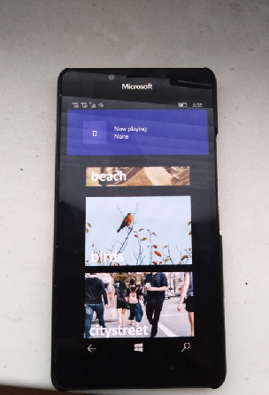

# Ambie for Windows 10 Mobile

A modern Windows app that plays soothing tones to help you be healthier, happier, and more relaxed.

## Motivation

The motivation behind Ambie is to build a simple but beautiful soothing sounds player for Windows. Animations are used to enhance the experience. Only a few UI elements are available in the app. This is on purpose because for Ambie, _less is more_.

## Contributors

Pull requests are welcome! Please keep in mind the motivation behind Ambie, however: _Less is more_. New sounds are greatly appreciated. New sounds must
- Have a license that can work with Ambie
- Have an image
- Have attributions for sound and image

## Attributions
- [Autofac](https://autofac.org/)
- [Windows Community Toolkit](https://github.com/windows-toolkit/WindowsCommunityToolkit)
- [WinUI library](aka.ms/winui/github)
- [Sounds](https://freesound.org). Specific file attributions are in `Data.json`.
- [Images](https://unsplash.com/). Specific image attributions are in `Data.json`.
- [Json.NET](https://github.com/JamesNK/Newtonsoft.Json)

## Thanks
- [Jenius Apps](https://github.com/jenius-apps)
- [Daniel Paulino](https://github.com/jenius-apps)
- [Ambie Project / AmbientSounds](https://github.com/jenius-apps/ambie)

### WARNING

Caution: this is my uncompleted work of porting eraly build of famous Ambie Sounds tool (Ambie 0.8) onto Windows 10 Mobile OS. Big problem: grid "buttons" don't wont to be clicked... 
I think there are some GridView/ XAML control bugs appeared when I switch SDK to 15063 os target .

Best wishes,

  [m][e] 2021
